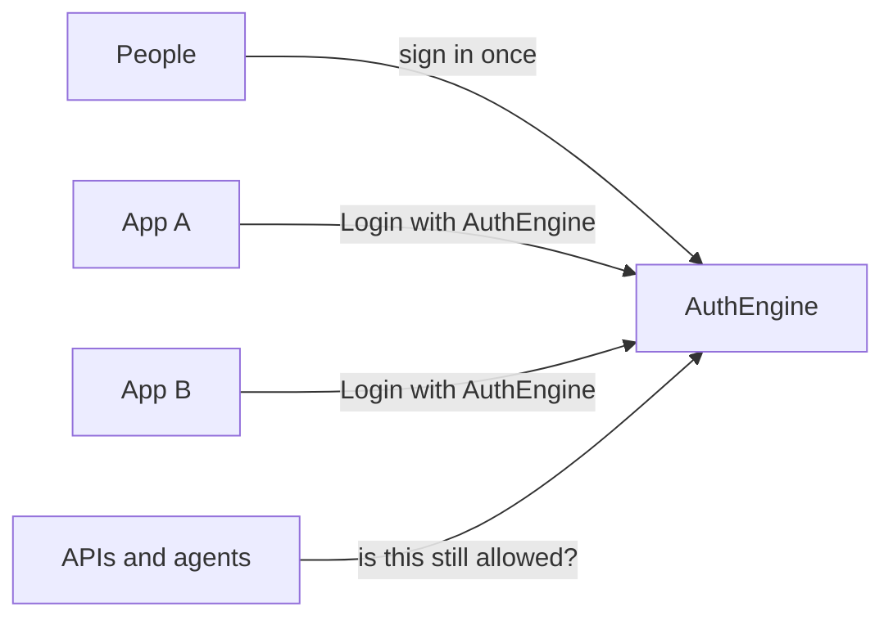

<div align="center">


# AuthEngine

## Open-source identity infrastructure for products and agents

One identity and one permission model for your products, APIs, and agents.

[Docs](https://docs.authengine.org) ·
[Website](https://authengine.org) ·
[Discussions](https://github.com/auth-engine/auth-engine/discussions) ·
[Roadmap](#roadmap)

</div>

AuthEngine is a self-hosted identity layer: one login, one set of organisations, one permission model, shared across every app, API, and agent you build.

- **Identity for products** — standard sign-in flow, session validation for APIs, per-organisation auth settings.
- **Identity for agents** — agents authenticate as trusted services and inherit the user's permissions; they cannot mint or escalate access.

Self-hosted. MIT license.

---

## Getting started

```bash
git clone https://github.com/auth-engine/auth-engine.git
cd auth-engine
docker compose up -d
```

| | |
|--|--|
| Dashboard | http://localhost:3000 |
| API | http://localhost:8000/docs |

Log in with the super-admin credentials in `docker-compose.yml`. Full guide: [Quick Start](https://docs.authengine.org/quick-start/).

---

## Contents

- [Getting started](#getting-started)
- [How it fits together](#how-it-fits-together)
- [Local development](#local-development)
- [Deployment](#deployment)
- [Security](#security)
- [Roadmap](#roadmap)
- [Contributing](#contributing)
- [Community](#community)
- [License](#license)

---

## How it fits together



| Piece | What it's for |
|-------|----------------|
| API | Identity, organisations, permissions, login, session checks |
| Dashboard | Admin UI for operators and tenant admins |
| PostgreSQL | People, organisations, roles, keys |
| Redis | Sessions, rate limits, one-time login steps |
| MongoDB | Audit history |

Full picture: [Architecture](https://docs.authengine.org/architecture/).

---

## Local development

Recommended: databases in Docker, API and dashboard on your machine.

```bash
docker compose up -d postgres mongo redis
```

**API** (Python 3.12+, [uv](https://docs.astral.sh/uv/)):

```bash
cd apps/api
uv sync --extra dev
cp .env.example .env.local
uv run auth-engine migrate
uv run auth-engine seed
uv run auth-engine run --reload
```

**Dashboard** (Node.js 20+):

```bash
cd apps/dashboard
cp .env.example .env.local
npm ci
npm run dev
```

Env, secrets, seed, migrations, troubleshooting: [Quick Start](https://docs.authengine.org/quick-start/).

---

## Deployment

| Path | When |
|------|------|
| [Docker Compose](#getting-started) | Try the published images locally |
| [Helm](deployment/helm/authengine) | Kubernetes / K3s |
| [Terraform](deployment/terraform) | AWS VPC + EC2 |
| [Deploy scripts](deployment/scripts) | Laptop VM or cloud VM |

Images: `qniranjan01/authengine` · `qniranjan01/authengine-dashboard`. Guide: [Deployment](https://docs.authengine.org/deployment/).

---

## Security

Do not open a public GitHub issue for vulnerabilities. Email **qniranjan.dev@gmail.com** with subject `AuthEngine Security Report` (72-hour acknowledgement target). Policy: [SECURITY.md](https://github.com/auth-engine/.github/blob/main/SECURITY.md).

---

## Roadmap

Shipped: multi-tenant identity, permissions, Login with AuthEngine, social login, magic links, MFA, passkeys, API session checks, deploy path.

Next:

- First-class agent identities (agent roles/credentials, still capped by granted permissions)
- Automated tests beyond lint and typecheck
- More identity providers and operator features

[Issues](https://github.com/auth-engine/auth-engine/issues) · [Feature requests](https://github.com/auth-engine/auth-engine/issues/new?template=feature_request.yml)

---

## Contributing

Read [Contributing](https://docs.authengine.org/contributing/). Look for `good first issue`.

1. Fork and branch from `main`.
2. Run the stack locally.
3. Keep changes focused; search existing issues first.
4. Never commit secrets.

PRs: API must be lint- and type-clean; dashboard `lint` and `build` must pass. Open against `main`.

---

## Community

| | |
|--|--|
| [Discussions](https://github.com/auth-engine/auth-engine/discussions) | Design talk, show-and-tell |
| [Issues](https://github.com/auth-engine/auth-engine/issues) | Bugs, features, questions |
| [Documentation](https://docs.authengine.org) | Guides and API reference |

---

## License

[MIT](LICENSE) © 2026 Niranjan Kumar.