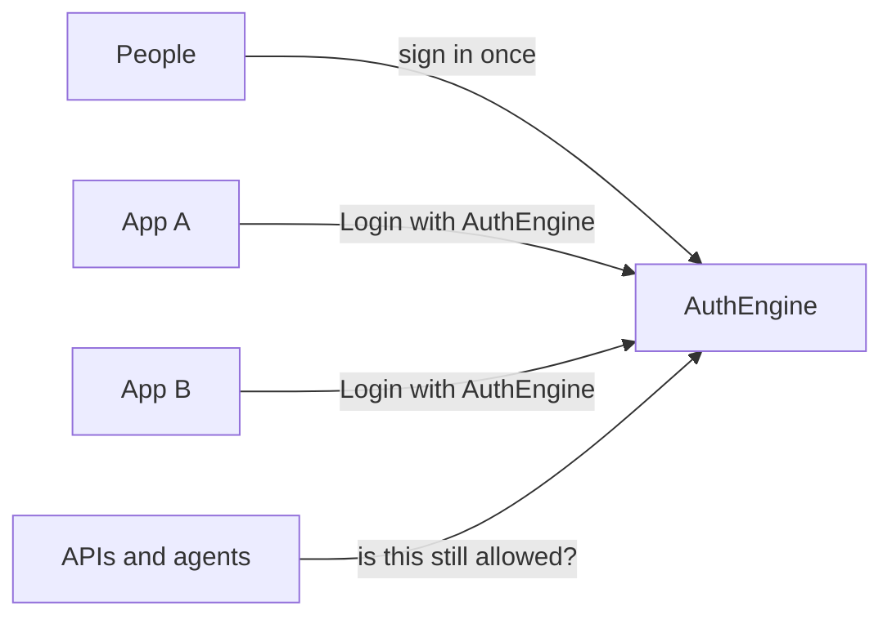

<div align="center">


# AuthEngine

## The open-source identity infrastructure for products and agents

One identity and one permission model to connect your products and your agents to the people who use them — every app, every API, every organisation.

[Learn more](https://docs.authengine.org) ·
[Report a bug](https://github.com/auth-engine/auth-engine/issues/new?template=bug_report.yml) ·
[Docs](https://docs.authengine.org) ·
[Website](https://authengine.org) ·
[Discussions](https://github.com/auth-engine/auth-engine/discussions) ·
[Roadmap](#roadmap)

</div>

Products used to be one app with one login. That no longer holds. People work across tools. Organisations share the same staff. Agents act on a user's behalf. Instead of a new account and a new meaning of “admin” in every service, they expect **one identity they can keep using**: switch organisation, open another app, pick up where they left off.

That shift — from login copied into every product to a **shared identity layer** — is what AuthEngine is built for.

---

## Why AuthEngine?

Every product and every agent eventually needs to know **who someone is**, **which organisation they are in**, and **what they may do**. AuthEngine is the open-source layer that handles that for you, so you don't rebuild users tables, permission checks, and session handling from scratch every time.

There are two ways to build with AuthEngine, and they share the same foundation: **a single identity and a unified permission model**.

- **Identity for products** — Sign in once. Apps use a standard login flow. APIs ask AuthEngine if the session is still valid. Each organisation chooses how its people sign in.
- **Identity for agents** — Connect any agent you've already built to the same identity. AuthEngine tells it who the user is and what they may do. The agent cannot mint access or go beyond those permissions.

Login libraries solve sign-in for **one** app. Large identity platforms solve SSO for the enterprise. Use those when they fit. Use AuthEngine when several products must trust the **same person**, the **same organisation**, and the **same permissions** — without putting signing secrets in every backend.

Self-hosted. MIT. Run it yourself.

---

## Getting started

Clone the repo and start the full stack:

```bash
git clone https://github.com/auth-engine/auth-engine.git
cd auth-engine
docker compose up -d
```

| | |
|--|--|
| Dashboard | [http://localhost:3000](http://localhost:3000) |
| API | [http://localhost:8000/docs](http://localhost:8000/docs) |

Log in with the super-admin credentials in `docker-compose.yml`. Changing code? See [local development](#local-development), or the [Quick Start](https://docs.authengine.org/quick-start/).

---

## Contents

- [Why AuthEngine?](#why-authengine)
- [Identity for products](#identity-for-products)
- [Identity for agents](#identity-for-agents)
- [Getting started](#getting-started)
- [How it fits together](#how-it-fits-together)
- [Local development](#local-development)
- [Deployment](#deployment)
- [Security](#security)
- [Roadmap](#roadmap)
- [Contributing](#contributing)
- [Community](#community)
- [License](#license)

---

## Identity for products

The identity platform that turns “every app has its own login” into **one place people, organisations, and permissions live**. Built for developers, designed to be self-hosted, powered by open source.

AuthEngine is the system of record for who someone is — not a wrapper around someone else's login. Your products sign people in through it. Your APIs ask it whether a session is still good. Your tenant admins invite members and set the rules without opening a ticket with engineering.

- **One person, many organisations** — Owner in one company, member in another. Same account. They choose which organisation they are working in; permissions follow that choice.
- **Permissions in one place** — Apps check what someone may do, not a homemade `is_admin` flag. Roles group those permissions. Nobody can grant more access than they have.
- **Your APIs never hold the signing secret** — A backend asks AuthEngine “is this session still valid?” and gets back the person, their organisation, and their permissions — or a clear no. Logout actually ends the session.
- **Login with AuthEngine** — Other products can sign people in with AuthEngine, not only with Google or GitHub.
- **Each organisation sets its own rules** — Password, magic link, Google, GitHub, Microsoft, authenticator apps, passkeys. MFA, session length, allowed email domains, and how invites are sent.
- **An admin dashboard** — Platform operators run tenants and keys. Tenant admins invite people and assign roles. End users keep one account.

Sign-in methods today: email and password, social login, magic links, authenticator-app MFA, and passkeys.

---

## Identity for agents

You build the agent. AuthEngine tells it **who may act**.

Agent Communication for identity is for teams already building agents that need to act for a real person, in a real organisation, with real limits. AuthEngine does not replace your agent. It is the layer the agent asks: who is this, which organisation are they in, and what are they allowed to do?

- **Bring your own agent** — Works with whatever you have already built. AuthEngine does not constrain agent logic.
- **Same permission model as people** — The agent sees the user's permissions. It cannot invent new ones.
- **Trusted services, not a second identity system** — Today an agent authenticates as a service. It can check a user's session. It cannot impersonate, escalate, or cross organisations.
- **Fail closed** — If the session is gone, the user is blocked, or the key is revoked, the answer is no.

First-class agent identities (agent-specific roles and credentials that still cannot exceed granted permissions) are on the [roadmap](#roadmap). They will sit on this same model, not beside it.

---

## How it fits together



| Piece | What it's for |
|-------|----------------|
| **API** | Identity, organisations, permissions, login, “is this session valid?” |
| **Dashboard** | How operators and tenant admins run it without living in API docs |
| **PostgreSQL** | People, organisations, roles, and keys |
| **Redis** | Sessions, limits, and one-time login steps |
| **MongoDB** | Audit history |

You run the platform. Each organisation controls how its people sign in. Full picture: [Architecture](https://docs.authengine.org/architecture/).

---

## Local development

Recommended when you are changing code: **databases in Docker**, API and dashboard on your machine.

```bash
docker compose up -d postgres mongo redis
```

**API** (Python 3.12+, [uv](https://docs.astral.sh/uv/)):

```bash
cd apps/api
uv sync --extra dev
cp .env.example .env.local
uv run auth-engine migrate
uv run auth-engine seed
uv run auth-engine run --reload
```

**Dashboard** (Node.js 20+):

```bash
cd apps/dashboard
cp .env.example .env.local
npm ci
npm run dev
```

Open [http://localhost:3000](http://localhost:3000) and [http://localhost:8000/docs](http://localhost:8000/docs).

Env, secrets, seed, migrations, and troubleshooting: [Quick Start](https://docs.authengine.org/quick-start/).

---

## Deployment

| Path | When |
|------|------|
| [Docker Compose](#getting-started) | Try the published images locally |
| [Helm](deployment/helm/authengine) | Kubernetes / K3s |
| [Terraform](deployment/terraform) | AWS VPC + EC2 |
| [Deploy scripts](deployment/scripts) | Laptop VM or a cloud VM |

Images: `qniranjan01/authengine` · `qniranjan01/authengine-dashboard`. Guide: [Deployment](https://docs.authengine.org/deployment/).

---

## Security

Sessions can be ended. APIs check identity without holding the signing secret. Passwords, MFA secrets, and service keys are stored so they cannot be read back. Security-relevant actions are audited.

Details: [Security overview](https://docs.authengine.org/security-overview/).

**Do not open a public GitHub issue for vulnerabilities.** Email **[qniranjan.dev@gmail.com](mailto:qniranjan.dev@gmail.com)** with subject `AuthEngine Security Report`. Acknowledgement target: **72 hours**. Policy: [SECURITY.md](https://github.com/auth-engine/.github/blob/main/SECURITY.md).

---

## Roadmap

Shipped: multi-tenant identity, permissions, Login with AuthEngine, social login, magic links, MFA, passkeys, session checks for APIs, and a deploy path.

Next in this repo:

- **First-class agent identities** — agent roles and credentials that still cannot exceed granted permissions
- **Automated tests** beyond lint and typecheck
- **More identity providers** and operator features as demand lands

Ideas: [GitHub issues](https://github.com/auth-engine/auth-engine/issues) · [feature requests](https://github.com/auth-engine/auth-engine/issues/new?template=feature_request.yml)

---

## Contributing

Please read [Contributing](https://docs.authengine.org/contributing/). Look for **`good first issue`**.

1. Fork and branch from `main`.
2. Run the stack locally.
3. Keep the change focused. Search existing issues first.
4. Never commit secrets.

Pull requests: API should be lint- and type-clean; dashboard `lint` and `build` should pass. Open against **`main`**.

---

## Community

| | |
|--|--|
| [Discussions](https://github.com/auth-engine/auth-engine/discussions) | Design talk, show-and-tell |
| [Issues](https://github.com/auth-engine/auth-engine/issues) | Bugs, features, questions |
| [Documentation](https://docs.authengine.org) | Guides and API reference |
| [Question](https://github.com/auth-engine/auth-engine/issues/new?template=question.yml) | “How do I…?” |

Security reports stay on email — see [Security](#security).

---

## License

[MIT](LICENSE) © 2026 Niranjan Kumar.
