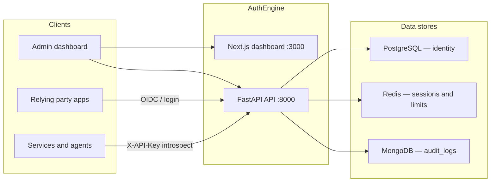

# AuthEngine

**One identity platform for every app and organisation.**

AuthEngine is a production-ready, multi-tenant identity and access layer — users sign in once; your apps, APIs, and partner products all trust the same identity, roles, and permissions.

[](LICENSE)
[](https://www.python.org/)
[](https://nodejs.org/)
[](https://github.com/auth-engine/auth-engine/actions/workflows/0-ci.yml)
[](https://docs.authengine.org)

| | |
|--|--|
| **Website** | [authengine.org](https://authengine.org) |
| **Documentation** | [docs.authengine.org](https://docs.authengine.org) |
| **API / Swagger** | [api.authengine.org/docs](https://api.authengine.org/docs) |
| **Dashboard** | [app.authengine.org](https://app.authengine.org) |
| **GitHub** | [github.com/auth-engine/auth-engine](https://github.com/auth-engine/auth-engine) |

---

## Contents

1. [Why AuthEngine?](#why-authengine)
2. [Core capabilities](#core-capabilities)
3. [AI agent authorization](#ai-agent-authorization)
4. [Architecture](#architecture)
5. [Getting started](#getting-started)
6. [Quick example](#quick-example)
7. [Project structure](#project-structure)
8. [Development](#development)
9. [Deployment](#deployment)
10. [Security](#security)
11. [Roadmap](#roadmap)
12. [Contributing](#contributing)
13. [Community / help](#community--help)
14. [Links](#links)
15. [License](#license)

---

## Why AuthEngine?

### The problem

When every product ships its own login, access control falls apart:

- Users juggle a separate account per app.
- Permission rules are copied into each service and drift.
- Signing secrets leak across backends, so revocation is unreliable.
- MFA, social login, invites, and audit are rebuilt — unevenly — for every new surface.

### What AuthEngine provides

A **single system of record** for people, organisations, sessions, and policy:

- Sign-in once (password, social, magic link, MFA, passkeys).
- One user, many tenants — different roles in each organisation.
- Permissions defined here, returned on login and on token introspection — not reimplemented in every API.
- OpenID Connect so other products can offer “Login with AuthEngine”.
- Service API keys so backends can validate a session **without** holding `JWT_SECRET_KEY`.
- Per-tenant auth policy (methods, MFA, password rules, email/SMS).

### Who it is for

| You are… | AuthEngine helps you… |
|----------|------------------------|
| **Platform operator** | Run tenants, service keys, global users, and audit. |
| **Tenant admin** | Invite members, assign roles, configure how your org signs in. |
| **App developer** | Add OIDC login, or introspect tokens in your API. |
| **End user** | One account — email, social, magic link, TOTP, or passkeys. |

---

## Core capabilities

### Authentication

| Method | What it does |
|--------|----------------|
| **Email / password** | Register, login, verify email or phone, password reset. Passwords hashed with Argon2. |
| **OAuth / OIDC (social)** | Google, GitHub, Microsoft — server-side code exchange, CSRF `state` in Redis, account linking. |
| **Magic links** | Passwordless email links: signed JWT, ~15 minute TTL, one-time JTI in Redis. |
| **MFA (TOTP)** | Authenticator-app second factor. Login returns **202** + `mfa_pending_token` until a valid code is presented. Secrets encrypted at rest. |
| **Passkeys / WebAuthn** | Register and authenticate hardware or platform authenticators. |

Each tenant chooses which methods are allowed (`GET/PUT /tenants/{id}/auth-config`). Platform login uses the platform tenant’s config.

### Authorization

AuthEngine enforces **PBAC** (permission-based access control) with **RBAC** as the grouping model.

- Endpoints check **permission strings** (for example `tenant.users.manage`), not role names.
- Roles collect permissions. Seeded roles live in [`data/rbac.json`](data/rbac.json).
- `SUPER_ADMIN` is granted `*` (all permissions) and is created by `auth-engine seed`, not assigned by hand.
- Role **level** (10–100) blocks assigning an equal or higher role — no lateral privilege escalation.

| Role | Level | Scope |
|------|-------|--------|
| `SUPER_ADMIN` | 100 | Platform |
| `PLATFORM_ADMIN` | 80 | Platform |
| `TENANT_OWNER` | 60 | Tenant |
| `TENANT_ADMIN` | 50 | Tenant |
| `TENANT_MANAGER` | 30 | Tenant |
| `TENANT_USER` | 10 | Tenant |

Guards: `require_permission` / `check_tenant_permission` on tenant paths; `check_platform_permission` on `/platform/*`. Missing permission → **403**.

### Identity

- **Users** — one profile, multiple `UserRole` rows (a person can be owner in one tenant and member in another).
- **Tenants** — `PLATFORM` (seeded, not creatable via API) and `CUSTOMER` organisations. After login, `POST /auth/select-tenant` issues a tenant-scoped JWT.
- **Service identities** — hashed API keys (`ae_sk_…`) for backends. Optional tenant scope. Raw key shown once; revocation is immediate on the next introspect.

### OIDC provider

AuthEngine is an OpenID Connect identity provider, not only a consumer of social login.

| Endpoint | Purpose |
|----------|---------|
| `GET /.well-known/openid-configuration` | Discovery |
| `GET /.well-known/jwks.json` | Public keys |
| `GET /api/v1/oidc/authorize` | Authorization Code + PKCE (S256) |
| `POST /api/v1/oidc/token` | Tokens (`client_secret_basic`, `client_secret_post`, `private_key_jwt`) |
| `GET/POST /api/v1/oidc/userinfo` | UserInfo |
| `POST /api/v1/oidc/register` | Dynamic client registration |

Prefer RS256 ID tokens with published JWKS in production. See [OAuth2 / OIDC guides](https://docs.authengine.org/oauth2-oidc-guides/).

---

## AI agent authorization

Agents, tools, and backend workers are **not a separate principal type yet**. They authenticate as **service identities** and may act only with a **user token** whose permissions AuthEngine already computed.

### Agent identity

Issue a service API key (`POST /api/v1/auth/service-keys`, permission `platform.tenants.manage`):

- Format `ae_sk_<64 hex>`; only a SHA-256 hash is stored.
- Optional `tenant_id` — a key bound to tenant A cannot introspect tenant B.
- Optional `expires_at`. `DELETE /api/v1/auth/service-keys/{id}` revokes on the next call.

The agent never receives `JWT_SECRET_KEY`. It cannot mint or widen tokens.

### Agent roles and permissions

An agent does not have its own role table. What it can *see* and what a user can *do* are separate:

| Surface | Bound by |
|---------|----------|
| Introspection response | The **user’s** permissions (optionally scoped to `tenant_id`) |
| Downstream API calls made with the user JWT | The same PBAC guards as any other client |

If you need a machine that is *not* acting for a human, keep its service key tenant-scoped and treat introspection as read-only trust — the key itself does not grant `tenant.users.manage` or other user permissions.

### Policy enforcement

`POST /api/v1/platform/service-keys/introspect` (`X-API-Key`) runs a closed check and returns `{ "active": false }` on any failure:

1. Verify JWT signature and expiry  
2. Reject blacklisted `jti`  
3. Require a live Redis session  
4. Load the user from Postgres  
5. Require `status == ACTIVE`  
6. Resolve permission strings (and `tenant_ids`)

Your agent then allows or denies the action from that list. AuthEngine routes do the same: no permission string → 403.

### An agent cannot act beyond granted permissions

That is the contract today:

- Service keys **introspect**; they do not impersonate or escalate.
- User JWTs carry only permissions already assigned through roles.
- Role levels stop a manager from granting admin to themselves or a peer.
- Tenant-scoped keys and tenant-scoped tokens cannot cross organisations.

Dedicated agent principals (agent-specific roles, short-lived agent credentials, tool-level grants) are on the [roadmap](#roadmap) — they will sit on this same PBAC model rather than beside it.

---

## Architecture



| Piece | Role |
|-------|------|
| **API** (`apps/api`) | IAM, tenancy, OIDC, PBAC, introspection. Single FastAPI process. CLI: `auth-engine`. |
| **Dashboard** (`apps/dashboard`) | Next.js App Router admin UI (platform + tenant + `/me`). Calls `/api/v1`. |
| **PostgreSQL** | Users, tenants, roles, permissions, OAuth accounts, OIDC clients, hashed service keys, tenant auth config. |
| **Redis** | Sessions, token blacklist, OAuth state, magic-link JTIs, MFA pending, rate limits, WebAuthn challenges. |
| **MongoDB** | Append-only `audit_logs`. |
| **Deployment** | Root `docker-compose.yml` for local full stack; Helm (K3s) + Terraform EC2 + deploy scripts under `deployment/`. |

Request path: router → auth / PBAC dependency → service → repository → store. Seed JSON in `data/` is applied only when you run `auth-engine seed` — not on API startup.

Full diagrams and Redis key patterns: [Architecture](https://docs.authengine.org/architecture/).

---

## Getting started

### Prerequisites

| Tool | Version |
|------|---------|
| Python | **3.12+** ([uv](https://docs.astral.sh/uv/)) |
| Node.js | **20+** |
| Docker | Compose v2 |
| OpenSSL | For local secrets and the OIDC RSA key |

### Clone

```bash
git clone https://github.com/auth-engine/auth-engine.git
cd auth-engine
```

### Environment setup

```bash
cp .env.example .env
openssl rand -hex 32   # set SECRET_KEY
openssl rand -hex 32   # set JWT_SECRET_KEY
openssl genrsa -out oidc_private.pem 2048
```

Keep `SUPERADMIN_EMAIL` / `SUPERADMIN_PASSWORD` in `.env` (or `apps/api/.env.local` for host runs). Profile fields for that user come from `data/super_admin.json`, not from git-tracked passwords.

### Docker Compose (full stack)

From the **repository root** — API image, dashboard image, Postgres, MongoDB, Redis:

```bash
docker compose up -d
docker exec authengine-api auth-engine migrate
docker exec authengine-api auth-engine seed
```

Images: `qniranjan01/authengine:latest` · `qniranjan01/authengine-dashboard:latest`.

### Open the apps

| Service | URL |
|---------|-----|
| API / Swagger | http://localhost:8000/docs |
| Health | http://localhost:8000/api/v1/health |
| Dashboard | http://localhost:3000 |
| OIDC discovery | http://localhost:8000/.well-known/openid-configuration |

Log in with the super-admin credentials from `.env`.

---

## Quick example

After seed, as super admin. Base URL `http://localhost:8000/api/v1`.

```bash
# 1. Authenticate
LOGIN=$(curl -s -X POST http://localhost:8000/api/v1/auth/login \
  -H "Content-Type: application/json" \
  -d '{"email":"admin@example.com","password":"ChangeThisStrongPassword123!"}')
TOKEN=$(echo "$LOGIN" | jq -r .access_token)
OWNER_ID=$(echo "$LOGIN" | jq -r .user.id)

# 2. Create a customer tenant
TENANT=$(curl -s -X POST http://localhost:8000/api/v1/platform/tenants \
  -H "Authorization: Bearer $TOKEN" \
  -H "Content-Type: application/json" \
  -d "{\"name\":\"Acme\",\"type\":\"CUSTOMER\",\"owner_id\":\"$OWNER_ID\"}")
TENANT_ID=$(echo "$TENANT" | jq -r .id)

# 3. Invite a user into the tenant (creates or attaches the account)
curl -s -X POST "http://localhost:8000/api/v1/tenants/$TENANT_ID/users" \
  -H "Authorization: Bearer $TOKEN" \
  -H "Content-Type: application/json" \
  -d '{"email":"alice@example.com","role_name":"TENANT_USER"}'

# 4. Permission catalog + custom tenant role
PERMS=$(curl -s "http://localhost:8000/api/v1/tenants/$TENANT_ID/roles/permissions" \
  -H "Authorization: Bearer $TOKEN")
# pick permission UUIDs from $PERMS, then:
curl -s -X POST "http://localhost:8000/api/v1/tenants/$TENANT_ID/roles" \
  -H "Authorization: Bearer $TOKEN" \
  -H "Content-Type: application/json" \
  -d '{"name":"Acme Auditor","level":15,"permissions":["<permission-uuid>"]}'

# 5. Assign that role to a member
curl -s -X POST "http://localhost:8000/api/v1/tenants/$TENANT_ID/users/<user-id>/roles" \
  -H "Authorization: Bearer $TOKEN" \
  -H "Content-Type: application/json" \
  -d '{"role_name":"Acme Auditor"}'

# 6. Alice signs in, selects the tenant, then a service authorizes via introspect
curl -s -X POST http://localhost:8000/api/v1/auth/select-tenant \
  -H "Authorization: Bearer <alice-access-token>" \
  -H "Content-Type: application/json" \
  -d "{\"tenant_id\":\"$TENANT_ID\"}"

curl -s -X POST http://localhost:8000/api/v1/platform/service-keys/introspect \
  -H "X-API-Key: ae_sk_<your-service-key>" \
  -H "Content-Type: application/json" \
  -d "{\"token\":\"<alice-tenant-jwt>\",\"tenant_id\":\"$TENANT_ID\"}"
```

Introspection returns `active`, user profile, `permissions`, and `tenant_ids`. Create a service key first with `POST /auth/service-keys`. Interactive walkthrough: [Swagger](http://localhost:8000/docs) or the dashboard at `/platform` and `/tenant`.

---

## Project structure

```
auth-engine/
├── apps/
│   ├── api/                 # FastAPI IAM API (`auth-engine` CLI, Alembic)
│   └── dashboard/           # Next.js admin UI
├── data/                    # JSON seed only (roles, super admin profile, platform config)
├── docs/                    # MkDocs project (config + pages)
├── deployment/
│   ├── helm/authengine/     # Kubernetes / K3s chart
│   ├── terraform/           # AWS VPC + EC2
│   └── scripts/             # deploy-local-vm.sh, deploy-aws.sh
├── docker-compose.yml       # Local full stack (images + databases)
├── README.md
└── LICENSE
```

| Path | What lives there |
|------|------------------|
| [`apps/api`](apps/api) | Routes, auth strategies, PBAC, OIDC, seed loader, migrations |
| [`apps/dashboard`](apps/dashboard) | Platform / tenant admin and user security UI |
| [`data`](data) | `rbac.json`, `super_admin.json`, `platform_config.json` — loaded by `auth-engine seed` |
| [`deployment`](deployment) | Helm, Terraform, production scripts (not Compose; Compose is at repo root) |
| [`docs`](docs) | MkDocs project (config + pages) — [docs.authengine.org](https://docs.authengine.org) |

---

## Development

Host API and dashboard against local databases (avoids port clashes with the prebuilt API/dashboard containers):

```bash
docker compose up -d postgres mongo redis
```

### Backend

```bash
cd apps/api
uv sync --extra dev
cp .env.example .env.local
uv run auth-engine migrate
uv run auth-engine seed
uv run auth-engine run --reload
```

CLI: `auth-engine run` · `migrate` · `makemigration "message"` · `seed` (`all` \| `roles` \| `superadmin` \| `platform-config`).

Seed data directory: walk parents for `data/rbac.json`, or set `AUTHENGINE_SEED_DATA_DIR`.

### Dashboard

```bash
cd apps/dashboard
cp .env.example .env.local
npm ci
npm run dev
```

`NEXT_PUBLIC_PLATFORM_TENANT_ID` may stay empty — login calls `GET /auth/auth-config` and uses the returned `tenant_id`.

### Tests

CI ([`.github/workflows/0-ci.yml`](.github/workflows/0-ci.yml)) runs **Ruff**, **mypy**, dashboard **ESLint**, and a production **Next.js build**. There is not yet a unit/integration test suite in-tree — contributions that add pytest (API) or frontend tests are welcome.

### Linting

```bash
# API
cd apps/api
uv run ruff check src
uv run ruff format src
uv run mypy src

# Dashboard
cd apps/dashboard
npm run lint
```

### Database migrations

```bash
cd apps/api
uv run auth-engine makemigration "add column …"
uv run auth-engine migrate          # alembic upgrade head
```

Run from `apps/api/` (where `alembic.ini` lives). Postgres schema only; Mongo audit collections are created by the API.

### Docs site

From `docs/` (MkDocs config, theme, and pages are all in that folder):

```bash
cd docs
pip install -r requirements.txt
mkdocs serve    # http://127.0.0.1:8000
```

---

## Deployment

### Docker

Published images:

- `qniranjan01/authengine:latest` — API + `data/` (`AUTHENGINE_SEED_DATA_DIR=/app/data`)
- `qniranjan01/authengine-dashboard:latest`

Local stack is the root Compose file in [Getting started](#getting-started). CI builds and pushes on merge to `main` (see `.github/workflows/1-build-push.yml`).

### Kubernetes / Helm

Chart: [`deployment/helm/authengine`](deployment/helm/authengine) — API, dashboard, Postgres, MongoDB, Redis, Ingress, migrate + seed Jobs.

```bash
cd deployment/helm/authengine
cp values.yaml prod-values.yaml    # set secrets.* and seed.*
helm upgrade --install authengine . -n authengine -f prod-values.yaml
```

Typical production topology: single-node **K3s** on a VM, **Rancher**, cert-manager, images from Docker Hub.

### Terraform

AWS VPC + EC2 (+ Elastic IP) in [`deployment/terraform`](deployment/terraform). Copy `terraform.tfvars.example` → `terraform.tfvars`. Prefer SSM over SSH (`allowed_ssh_cidr` empty).

### Opinionated scripts

| Path | Use |
|------|-----|
| [`deployment/scripts/deploy-local-vm.sh`](deployment/scripts/deploy-local-vm.sh) | Laptop VM + Cloudflare Tunnel |
| [`deployment/scripts/deploy-aws.sh`](deployment/scripts/deploy-aws.sh) | Cloud VM (AWS or any Linux VM with a public IP) |

```bash
cd deployment
./scripts/deploy-local-vm.sh all
./scripts/deploy-aws.sh all
```

Lab: **4 vCPU / 8 GB RAM / 40 GB**. Production: **16 GB RAM** recommended. Guide: [Deployment](https://docs.authengine.org/deployment/).

---

## Security

### Security model

- Users authenticate with password, OAuth, magic link, TOTP, or WebAuthn.
- Access tokens are short-lived JWTs (default 30 minutes); refresh is bound to a Redis session (default 7 days, max concurrent sessions configurable).
- Relying party **backends never share** `JWT_SECRET_KEY`. They call introspection with a service key.
- PBAC + role levels are the authorization boundary for every `/platform` and `/tenants` route.
- Passwords: Argon2. MFA secrets: Fernet from `SECRET_KEY`. Service keys: SHA-256 only at rest.
- Rate limiting (Redis, per IP) when `RATE_LIMIT_ENABLED=true`.
- Security-relevant actions append to MongoDB `audit_logs`.

Details: [Security overview](https://docs.authengine.org/security-overview/).

### Security policy

Canonical policy: [docs/security-policy.md](docs/security-policy.md) · [GitHub SECURITY.md](https://github.com/auth-engine/.github/blob/main/SECURITY.md).

`main` is supported. Older tags: best effort — upgrade.

### Reporting vulnerabilities

**Do not open a public GitHub issue.**

Email **[qniranjan.dev@gmail.com](mailto:qniranjan.dev@gmail.com)** with subject `AuthEngine Security Report`. Include description, reproduction, affected component (`apps/api`, `apps/dashboard`, `data`, `deployment`, `docs`), and impact if known. Acknowledgement target: **72 hours**.

---

## Roadmap

Shipped: multi-tenant IAM, RBAC/PBAC, OIDC provider, social login, magic links, TOTP, passkeys, service-key introspection, Helm/Terraform deploy path.

Next, in this repo:

- **First-class AI agent identities** — agent principals, agent roles, and credentials that still cannot exceed granted permissions.
- **Automated tests** — API (pytest) and dashboard coverage beyond lint/typecheck/build.
- **More identity providers** and operator features (for example SCIM-style provisioning) as demand lands.

Ideas and sequencing: [GitHub issues](https://github.com/auth-engine/auth-engine/issues) and [feature requests](https://github.com/auth-engine/auth-engine/issues/new?template=feature_request.yml).

---

## Contributing

Please read [Contributing](https://docs.authengine.org/contributing/) (canonical GitHub copy: [auth-engine/.github](https://github.com/auth-engine/.github/blob/main/CONTRIBUTING.md)).

### Good first issues

Look for the **`good first issue`** label: [open issues](https://github.com/auth-engine/auth-engine/issues?q=label%3A%22good+first+issue%22). Docs, seed JSON, lint, and dashboard copy are typical on-ramps.

### Development workflow

1. Fork and branch from `main` (`feature/…`, `fix/…`, `docs/…`).
2. Run the stack locally ([Development](#development)).
3. Keep the change focused. Search [existing issues](https://github.com/auth-engine/auth-engine/issues) first; open an issue before large refactors.
4. Never commit secrets — examples only (`.env.example`, `apps/api/.env.example`).

### Pull requests

- API: `ruff` + `mypy` clean; run migrations if models changed.
- Dashboard: `npm run lint` and `npm run build` must pass.
- Describe what, why, how tested; link `Fixes #123`.
- Open against **`main`**.

---

## Community / help

| Channel | Use |
|---------|-----|
| [Discussions](https://github.com/auth-engine/auth-engine/discussions) | Design talk, show-and-tell |
| [Issues](https://github.com/auth-engine/auth-engine/issues) | Bugs, features, questions ([templates](.github/ISSUE_TEMPLATE)) |
| [Documentation](https://docs.authengine.org) | Guides, API reference, architecture |
| [Question template](https://github.com/auth-engine/auth-engine/issues/new?template=question.yml) | “How do I…?” |

Security reports stay on email — see [Security](#security).

---

## Links

| | |
|--|--|
| Website | [authengine.org](https://authengine.org) |
| Documentation | [docs.authengine.org](https://docs.authengine.org) |
| API (production) | [api.authengine.org](https://api.authengine.org) · [Swagger](https://api.authengine.org/docs) |
| Dashboard (demo / app) | [app.authengine.org](https://app.authengine.org) |
| GitHub | [github.com/auth-engine/auth-engine](https://github.com/auth-engine/auth-engine) |
| Docker Hub | [qniranjan01/authengine](https://hub.docker.com/r/qniranjan01/authengine) |

Local demo after Compose: [http://localhost:3000](http://localhost:3000) and [http://localhost:8000/docs](http://localhost:8000/docs).

---

## License

[MIT](LICENSE) © 2026 Niranjan Kumar.
