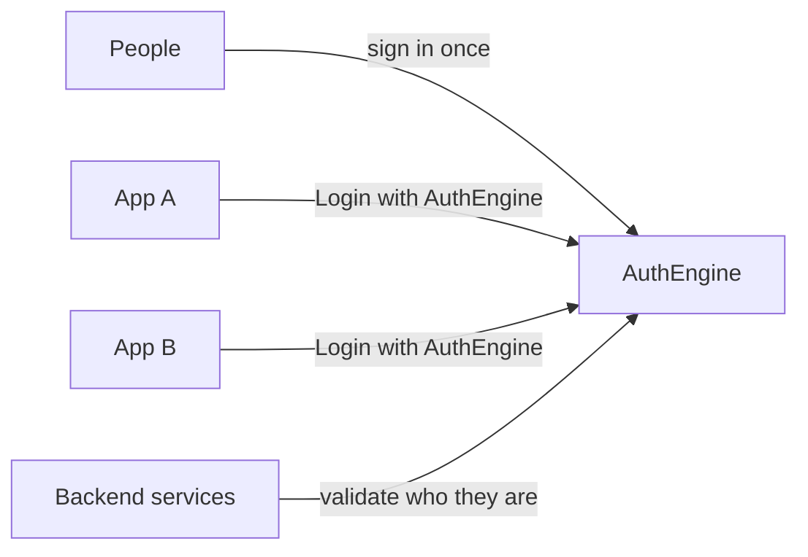

# AuthEngine

Sign in once. Every app, API, and organisation trusts the same identity.

Open-source IAM · OpenID Connect provider · tenant-scoped permissions · token introspection

Stop copying login into every product. AuthEngine is the **open-source, self-hosted** identity layer they share: one user, many tenants, permission strings on every route, and backends that validate a session **without** holding the signing secret.

[Read the full story →](about-author.md)

---

## Why central identity?

Login libraries and enterprise IdPs already exist. Most of them **sign a user into one app**, or they stop at SSO and tokens. Teams still ship **N copies** of identity: another users table, another `is_admin` check, another copy of the JWT secret — so logout cannot kill a session and “admin” means something different in every service.

AuthEngine is that layer **once**: who the user is, which organisation they are in, and which **permission strings** they hold. Apps use OpenID Connect. APIs call introspection with a hashed service key — they never receive `JWT_SECRET_KEY`. Use a library for a single app; use a large IdP when you need SAML, LDAP, and a long production history; use AuthEngine when several products must share the same identity.

| Benefit | What it means for you |
|---------|----------------------|
| **One account, many organizations** | Users belong to multiple tenants with different roles |
| **Login with AuthEngine** | Browser and mobile apps use standard OpenID Connect |
| **Token validation for APIs** | Backend services verify sessions without sharing secrets |
| **Permissions in one place** | Roles and access rules defined once, enforced everywhere |
| **Policy per organization** | Each tenant chooses sign-in methods, MFA, and session rules |

!!! tip "Want the full picture?"
    See **[About](about-author.md)** for the problem breakdown, integration models, capabilities, and author details.

---

## Who it's for

| You are… | AuthEngine helps you… |
|----------|----------------------|
| **Platform operator** | Run tenants, service keys, and global user management |
| **Tenant admin** | Invite members, assign roles, configure login for your org |
| **App developer** | Add “Login with AuthEngine” or validate tokens in your API |
| **End user** | Sign in once with email, social, magic link, MFA, or passkeys |

---

## Get started

Follow this order based on your goal:

| Step | Guide | When to read |
|:----:|-------|--------------|
| **1** | [Quick Start](quick-start.md) | First time — run the stack locally |
| **2** | [Architecture](architecture.md) | Understand components and data flow |
| **3** | [Deployment](deployment.md) | Ship to a VM (cloud or laptop + Cloudflare) |
| **4** | [Security Overview](security-overview.md) | Harden tokens, sessions, and access |
| **5** | [API Reference](api-reference.md) | Integrate with REST endpoints |
| **6** | [OAuth2 / OIDC](oauth2-oidc-guides.md) | Social login or use AuthEngine as an IdP |
| **7** | [Contributing](contributing.md) | Open source — PRs, issues, local dev |
| **8** | [Security Policy](security-policy.md) | Report vulnerabilities responsibly |

!!! tip "New here?"
    **[Quick Start](quick-start.md)** → **[Architecture](architecture.md)** → **[Deployment](deployment.md)**

!!! info "Building an integration?"
    **[API Reference](api-reference.md)** and **[OAuth2 / OIDC](oauth2-oidc-guides.md)** after Architecture.

---

## Live sites

Public demo hosts (not a production-readiness claim):

| Host | Role |
|------|------|
| [authengine.org](https://authengine.org) | Product home (redirects to app) |
| [api.authengine.org](https://api.authengine.org) | REST API · [Swagger](https://api.authengine.org/docs) |
| [auth.authengine.org](https://auth.authengine.org) | Login and identity provider |
| [app.authengine.org](https://app.authengine.org) | Admin dashboard |
| [docs.authengine.org](https://docs.authengine.org) | This documentation |

**Local:** API `http://localhost:8000` · Dashboard `http://localhost:3000`

---

## Layout

| Folder | Purpose |
|--------|---------|
| [`apps/api`](https://github.com/auth-engine/auth-engine/tree/main/apps/api) | FastAPI IAM API |
| [`apps/dashboard`](https://github.com/auth-engine/auth-engine/tree/main/apps/dashboard) | Admin dashboard |
| [`data/`](https://github.com/auth-engine/auth-engine/tree/main/data) | JSON seed data |
| [`deployment/`](https://github.com/auth-engine/auth-engine/tree/main/deployment) | Helm, Terraform, deploy scripts |
| [`docs/`](https://github.com/auth-engine/auth-engine/tree/main/docs) | This documentation site |
| [`docker-compose.yml`](https://github.com/auth-engine/auth-engine/blob/main/docker-compose.yml) | Local databases and full stack |

**Contributing:** [contributing.md](contributing.md) · **Security reports:** [security-policy.md](security-policy.md)

---

## Quick reference

| Endpoint | URL |
|----------|-----|
| OIDC discovery | `GET https://api.authengine.org/.well-known/openid-configuration` |
| JWKS | `GET https://api.authengine.org/.well-known/jwks.json` |
| Token introspect | `POST https://api.authengine.org/api/v1/platform/service-keys/introspect` |
| Health | `GET https://api.authengine.org/api/v1/health` |

Introspection requires header `X-API-Key: ae_sk_<hex>`.
